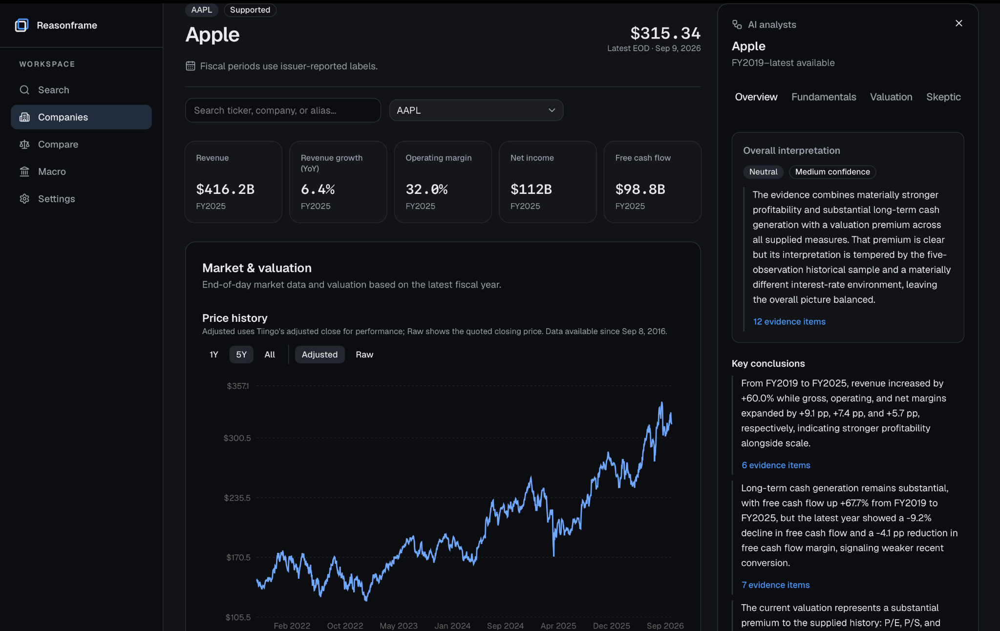
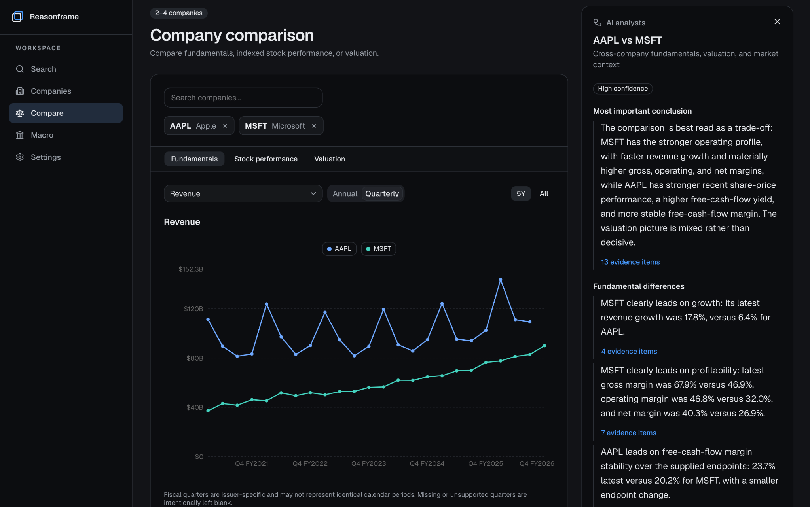
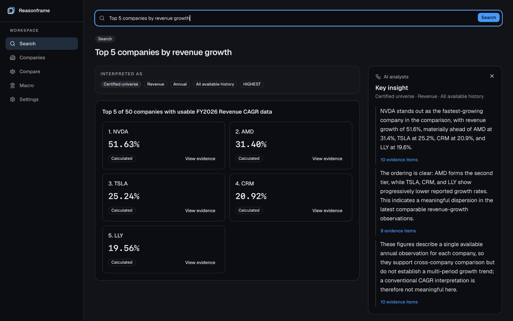
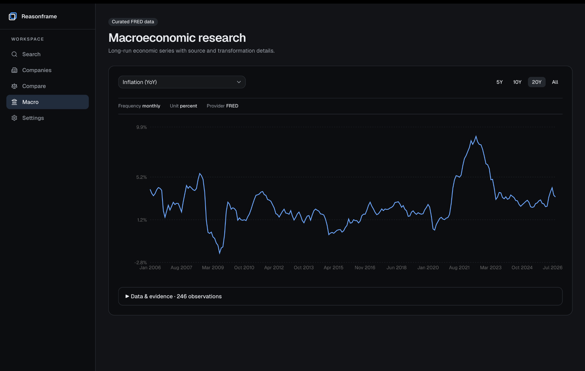

# Reasonframe

**Financial research with specialist AI analysts.**

Reasonframe is a local-first desktop application for researching public companies through financial statements, market data, valuation, comparison, macroeconomic context, structured search, and AI analysis.



## Why Reasonframe

Financial software is good at retrieving data and performing calculations. General-purpose AI is good at interpretation, but it should not be responsible for inventing or recomputing financial facts.

Reasonframe separates those jobs: **the application provides the facts and calculations; AI analysts provide structured interpretation.** Analyst workflows operate on bounded research evidence assembled by the application, while the underlying data remains inspectable from the interface.

The result is a research workflow that feels closer to working through a company with several specialist perspectives than chatting with a generic finance bot.

## What you can do

- **Research companies** — inspect financial statements, historical metrics, market performance, and deterministic valuation.
- **Run specialist AI analysis** — independent Fundamentals and Valuation analysis, followed by Skeptic review and a synthesized Overview.
- **Compare companies** — analyze 2–4 companies across fundamentals, stock performance, and valuation, with cross-company AI synthesis.
- **Search financial data** — ask structured questions about metrics, histories, comparisons, rankings, changes, and CAGR.
- **Explore macro context** — view curated long-run FRED series with the underlying observations and transformation details.
- **Inspect evidence** — trace reported values, calculated outputs, and AI claims back to the data used by the application.

## Specialist AI analysis

Reasonframe's company workflow uses multiple analytical stages rather than a single general-purpose response:

```text
Fundamentals ─┐
              ├──> Skeptic ──> Overview
Valuation ────┘
```

Fundamentals and Valuation run independently. The Skeptic stage challenges the resulting analysis. Overview then synthesizes the result into the most important conclusions, risks, uncertainties, and a confidence assessment.

AI is not used to calculate values that the application can calculate directly. Analyst runs receive structured evidence packets and do not receive general web or tool access.

## Compare

Compare 2–4 companies without forcing every company into identical assumptions. Missing or partially comparable metrics remain visible as caveats instead of causing the whole analysis to fail.



## Search

Search is designed for financial questions rather than open-ended chat. It supports scalar queries, histories, pairwise comparisons, explicit-subset and universe rankings, highest/lowest queries, changes, CAGR, aliases, and relative dates.

Ranking and growth calculations are performed by the application before AI receives the result.



## Macro

Reasonframe includes a curated set of FRED macroeconomic series for adding long-run economic context to company research.



## Local-first by design

Reasonframe is packaged as a desktop application with a Tauri 2 shell and a local FastAPI sidecar. Application state and research data are stored in OS-local app-data directories, with SQLite serving normal browsing and analysis requests.

Market history is downloaded using the user's own Tiingo API token and stored locally. Reasonframe does not redistribute a pre-populated Tiingo market-data database.

The local-first model is intentional: the application can own its financial calculations, cache research data locally, and send AI providers bounded analysis inputs rather than handing an unconstrained model the entire research process.

## Data sources

Reasonframe currently combines:

- **SEC filings** — company fundamentals normalized from SEC/XBRL data using the fair-access identity included with the v0.1.0 release.
- **Tiingo** — end-of-day market history, splits, and dividends using a user-supplied API token.
- **FRED** — a curated set of macroeconomic series with access included in the v0.1.0 release.

Tiingo users must supply their own token. Create or sign in to a [Tiingo account](https://api.tiingo.com), open the [API token page](https://api.tiingo.com/account/api/token), copy the token, and paste it into Reasonframe during onboarding. Reasonframe validates it before saving it in the app's owner-only local data directory. Treat the token like a password and do not publish it. Tiingo offers free accounts and paid plans with different usage limits; see the [official API documentation](https://www.tiingo.com/documentation/general) for current details.

The packaged v0.1.0 application includes its FRED access and SEC fair-access identity. Only release maintainers need to configure those values when producing a desktop build.

## Certified company universe

Reasonframe intentionally limits normal company browsing to data that has passed its certification checks. The current release exposes **50 supported companies**.

Certification is a quality boundary: incomplete or poorly normalized company data is not silently presented as if it were fully supported. Reasonframe is therefore intentionally narrower than a full-market terminal today.

## Getting started

### macOS

The strongest packaged support today is **macOS on Apple Silicon (ARM64)**.

1. Download the latest Reasonframe DMG from the repository's **Releases** page.
2. Install and open `Reasonframe.app`.
3. Create or sign in to [Tiingo](https://api.tiingo.com), copy your token from the [API token page](https://api.tiingo.com/account/api/token), and paste it into onboarding. FRED and SEC access are included.
4. Connect a supported AI provider if you want to use analyst workflows.
5. Allow the initial local data setup to complete.

Once the initialization request is accepted, its button is disabled and live source progress is shown. SEC, Tiingo, and FRED load concurrently, so one slower source does not prevent the others from progressing. Each completed unit is checkpointed: initialization can be resumed after closing the app, and a Tiingo rate-limit pause can be continued after the account's request window resets. Subsequent refreshes can run automatically or manually from Settings.

### AI providers

**ChatGPT subscription** is the primary integration. Reasonframe uses OpenAI's documented browser login through its bundled Codex SDK runtime: click sign in, finish in the browser, and the local callback connects the app automatically. No API key, security-setting change, one-time device code, or globally installed `codex` command is required. See OpenAI's [authentication](https://learn.chatgpt.com/docs/auth) and [app-server](https://learn.chatgpt.com/docs/app-server) documentation.

**Claude subscription** is supported through the official Claude Agent SDK. Sign in through Claude Code, run `claude setup-token`, and paste the resulting `sk-ant-oat…` token into Reasonframe's masked field. This is a one-time setup unless the token is revoked or disconnected; Reasonframe keeps it in the operating-system credential store. The SDK's bundled runtime receives a custom system prompt and no tools, MCP servers, settings sources, plugins, or skills. See Anthropic's [subscription guidance](https://support.claude.com/en/articles/15036540-use-the-claude-agent-sdk-with-your-claude-plan) and [Agent SDK documentation](https://code.claude.com/docs/en/agent-sdk/python).

Anthropic does not currently document an embeddable Claude.ai subscription browser-login callback for the Agent SDK. Claude Code's browser login belongs to the interactive CLI, while `ant auth login` uses Console/API billing, so Reasonframe deliberately retains the one-time inference-only setup-token step.

Both integrations use provider-owned SDK runtimes internally. They do not make raw public API calls with consumer-subscription OAuth credentials. A provider-status **Try again** action appears only when a bundled runtime could not initialize or status could not be loaded; connected providers no longer need a separate CLI-detection retry. See the [feasibility report](docs/ai-provider-feasibility.md) for the exact boundary.

## Architecture

```text
┌─────────────────────────────┐
│     React / TypeScript      │
│        Tauri 2 shell        │
└──────────────┬──────────────┘
               │ localhost
               ▼
┌─────────────────────────────┐
│      FastAPI sidecar        │
├─────────────────────────────┤
│ SQLite                      │
│ SEC / XBRL normalization    │
│ Tiingo market data          │
│ Curated FRED macro data     │
│ Deterministic calculations  │
│ AI provider layer           │
└─────────────────────────────┘
```

The frontend is built with React, TypeScript, Vite, Tailwind/shadcn-style components, and Recharts. The backend is Python/FastAPI with SQLite, Pydantic, SEC/XBRL normalization, and curated FRED data.

Reasonframe is deliberately a local desktop project rather than a hosted multi-user platform.

## Current limitations

- Packaged release support is currently strongest on **macOS Apple Silicon (ARM64)**.
- Market data requires a user-supplied **Tiingo API token**.
- FRED access and the SEC fair-access identity are included with the **v0.1.0 packaged release**.
- Tiingo market data is downloaded locally and is **not redistributed** with Reasonframe.
- The normal product universe is limited to companies that pass Reasonframe's certification checks.
- Apple notarization may still be pending for early release artifacts.
- Reasonframe does **not** provide Buy/Hold/Sell recommendations, price targets, forecasts, fair values, DCFs, or forward valuation.

## Project status

Reasonframe is an independent project. The current pre-release is **v0.1.0-rc.2**: a release candidate focused on a polished macOS desktop experience, a deliberately bounded company universe, and transparent research workflows.

The project is not intended to replace institutional market-data platforms or professional investment judgment.

## Development

Python 3.12, Node.js/npm, Rust, Tauri's macOS prerequisites, and `uv` are required for the full desktop build.

```bash
python3.12 -m venv .venv
.venv/bin/pip install -e '.[test]'
cd frontend && npm install
```

Copy `.env.example` to `.env` and provide development-only data-source credentials. Run the backend and frontend in separate terminals:

```bash
.venv/bin/uvicorn finance_terminal.api:app --host 127.0.0.1 --port 8000
cd frontend && npm run dev
```

Run the routine checks:

```bash
.venv/bin/python -m pytest -m 'not live'
cd frontend && npm test
cd frontend && npm run lint
cd frontend && npm run build
```

Build the macOS sidecar and desktop package:

```bash
scripts/build-macos-sidecar.sh
cd frontend && npm run desktop:build
```

Build outputs are generated under `frontend/src-tauri/target/release/bundle/` and should be attached to a GitHub Release rather than committed to source control.

## Data, trademarks, and disclaimer

Reasonframe is an independent project and is not affiliated with or endorsed by the U.S. Securities and Exchange Commission, the Federal Reserve Bank of St. Louis, Tiingo, OpenAI, or Anthropic. Product and company names belong to their respective owners.

Financial information can be incomplete, delayed, restated, or interpreted differently across sources. Reasonframe is a research tool, not an investment adviser, and its outputs are not investment advice.

<!-- Before public release: add the chosen LICENSE file and, if desired, a short License section here. -->
